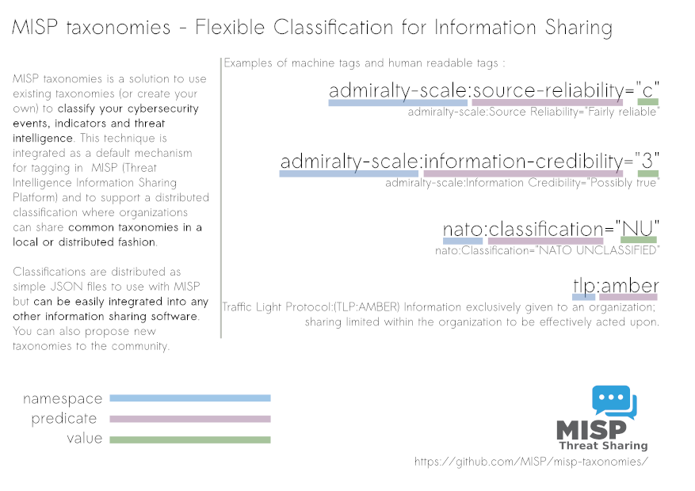

# MISP Taxonomies

MISP Taxonomies is a set of common classification libraries to tag, classify and organise information. Taxonomy allows to express the same vocabulary among a distributed set of users and organisations.

Taxonomies that can be used in [MISP](https://github.com/MISP/MISP) and other information sharing tool, are expressed in Machine Tags (Triple Tags). A machine tag is composed of a namespace (MUST), a predicate (MUST) and an (OPTIONAL) value. Machine tags are often called triple tag due to their format.

The following taxonomies can be used in MISP (as local or distributed tags) or in other tools and software willing to share common taxonomies among security information sharing tools.

## List of available taxonomies

### CERT-XLM

[CERT-XLM](https://github.com/MISP/misp-taxonomies/tree/main/CERT-XLM) :
CERT-XLM Security Incident Classification. [Overview](https://www.misp-project.org/taxonomies.html#_cert_xlm)

### DFRLab-dichotomies-of-disinformation

[DFRLab-dichotomies-of-disinformation](https://github.com/MISP/misp-taxonomies/tree/main/DFRLab-dichotomies-of-disinformation) :
DFRLab Dichotomies of Disinformation. [Overview](https://www.misp-project.org/taxonomies.html#_dfrlab_dichotomies_of_disinformation)

### DML

[DML](https://github.com/MISP/misp-taxonomies/tree/main/DML) :
The Detection Maturity Level (DML) model is a capability maturity model for referencing ones maturity in detecting cyber attacks.  It's designed for organizations who perform intel-driven detection and response and who put an emphasis on having a mature detection program. [Overview](https://www.misp-project.org/taxonomies.html#_dml)

### GrayZone

[GrayZone](https://github.com/MISP/misp-taxonomies/tree/main/GrayZone) :
Gray Zone of Active defense includes all elements which lay between reactive defense elements and offensive operations. It does fill the gray spot between them. Taxo may be used for active defense planning or modeling. [Overview](https://www.misp-project.org/taxonomies.html#_grayzone)

### PAP

[PAP](https://github.com/MISP/misp-taxonomies/tree/main/PAP) :
The Permissible Actions Protocol - or short: PAP - was designed to indicate how the received information can be used. [Overview](https://www.misp-project.org/taxonomies.html#_pap)

### access-method

[access-method](https://github.com/MISP/misp-taxonomies/tree/main/access-method) :
The access method used to remotely access a system. [Overview](https://www.misp-project.org/taxonomies.html#_access_method)

### accessnow

[accessnow](https://github.com/MISP/misp-taxonomies/tree/main/accessnow) :
Access Now classification to classify an issue (such as security, human rights, youth rights). [Overview](https://www.misp-project.org/taxonomies.html#_accessnow)

### acs-marking

[acs-marking](https://github.com/MISP/misp-taxonomies/tree/main/acs-marking) :
The Access Control Specification (ACS) marking type defines the object types required to implement automated access control systems based on the relevant policies governing sharing between participants. [Overview](https://www.misp-project.org/taxonomies.html#_acs_marking)

### action-taken

[action-taken](https://github.com/MISP/misp-taxonomies/tree/main/action-taken) :
Action taken in the case of a security incident (CSIRT perspective). [Overview](https://www.misp-project.org/taxonomies.html#_action_taken)

### admiralty-scale

[admiralty-scale](https://github.com/MISP/misp-taxonomies/tree/main/admiralty-scale) :
The Admiralty Scale or Ranking (also called the NATO System) is used to rank the reliability of a source and the credibility of an information. Reference based on FM 2-22.3 (FM 34-52) HUMAN INTELLIGENCE COLLECTOR OPERATIONS and NATO documents. [Overview](https://www.misp-project.org/taxonomies.html#_admiralty_scale)

### adversary

[adversary](https://github.com/MISP/misp-taxonomies/tree/main/adversary) :
An overview and description of the adversary infrastructure [Overview](https://www.misp-project.org/taxonomies.html#_adversary)

### ais-marking

[ais-marking](https://github.com/MISP/misp-taxonomies/tree/main/ais-marking) :
The AIS Marking Schema implementation is maintained by the National Cybersecurity and Communication Integration Center (NCCIC) of the U.S. Department of Homeland Security (DHS) [Overview](https://www.misp-project.org/taxonomies.html#_ais_marking)

### analyst-assessment

[analyst-assessment](https://github.com/MISP/misp-taxonomies/tree/main/analyst-assessment) :
A series of assessment predicates describing the analyst capabilities to perform analysis. These assessment can be assigned by the analyst him/herself or by another party evaluating the analyst. [Overview](https://www.misp-project.org/taxonomies.html#_analyst_assessment)

### approved-category-of-action

[approved-category-of-action](https://github.com/MISP/misp-taxonomies/tree/main/approved-category-of-action) :
A pre-approved category of action for indicators being shared with partners (MIMIC). [Overview](https://www.misp-project.org/taxonomies.html#_approved_category_of_action)

### artificial-satellites

[artificial-satellites](https://github.com/MISP/misp-taxonomies/tree/main/artificial-satellites) :
This taxonomy was designed to describe artificial satellites [Overview](https://www.misp-project.org/taxonomies.html#_artificial_satellites)

### aviation

[aviation](https://github.com/MISP/misp-taxonomies/tree/main/aviation) :
A taxonomy describing security threats or incidents against the aviation sector. [Overview](https://www.misp-project.org/taxonomies.html#_aviation)

### binary-class

[binary-class](https://github.com/MISP/misp-taxonomies/tree/main/binary-class) :
Custom taxonomy for types of binary file. [Overview](https://www.misp-project.org/taxonomies.html#_binary_class)

### cccs

[cccs](https://github.com/MISP/misp-taxonomies/tree/main/cccs) :
Internal taxonomy for CCCS. [Overview](https://www.misp-project.org/taxonomies.html#_cccs)

### circl

[circl](https://github.com/MISP/misp-taxonomies/tree/main/circl) :
CIRCL Taxonomy - Schemes of Classification in Incident Response and Detection. [Overview](https://www.misp-project.org/taxonomies.html#_circl)

### cnsd

[cnsd](https://github.com/MISP/misp-taxonomies/tree/main/cnsd) :
La presente taxonomia es la primera versión disponible para el Centro Nacional de Seguridad Digital del Perú. [Overview](https://www.misp-project.org/taxonomies.html#_cnsd)

### coa

[coa](https://github.com/MISP/misp-taxonomies/tree/main/coa) :
Course of action taken within organization to discover, detect, deny, disrupt, degrade, deceive and/or destroy an attack. [Overview](https://www.misp-project.org/taxonomies.html#_coa)

### collaborative-intelligence

[collaborative-intelligence](https://github.com/MISP/misp-taxonomies/tree/main/collaborative-intelligence) :
Collaborative intelligence support language is a common language to support analysts to perform their analysis to get crowdsourced support when using threat intelligence sharing platform like MISP. The objective of this language is to advance collaborative analysis and to share earlier than later. [Overview](https://www.misp-project.org/taxonomies.html#_collaborative_intelligence)

### common-taxonomy

[common-taxonomy](https://github.com/MISP/misp-taxonomies/tree/main/common-taxonomy) :
Common Taxonomy for Law enforcement and CSIRTs [Overview](https://www.misp-project.org/taxonomies.html#_common_taxonomy)

### copine-scale

[copine-scale](https://github.com/MISP/misp-taxonomies/tree/main/copine-scale) :
The COPINE Scale is a rating system created in Ireland and used in the United Kingdom to categorise the severity of images of child sex abuse. The scale was developed by staff at the COPINE (Combating Paedophile Information Networks in Europe) project. The COPINE Project was founded in 1997, and is based in the Department of Applied Psychology, University College Cork, Ireland. [Overview](https://www.misp-project.org/taxonomies.html#_copine_scale)

### course-of-action

[course-of-action](https://github.com/MISP/misp-taxonomies/tree/main/course-of-action) :
A Course Of Action analysis considers six potential courses of action for the development of a cyber security capability. [Overview](https://www.misp-project.org/taxonomies.html#_course_of_action)

### crowdsec

[crowdsec](https://github.com/MISP/misp-taxonomies/tree/main/crowdsec) :
Crowdsec IP address classifications and behaviors taxonomy. [Overview](https://www.misp-project.org/taxonomies.html#_crowdsec)

### cryptocurrency-threat

[cryptocurrency-threat](https://github.com/MISP/misp-taxonomies/tree/main/cryptocurrency-threat) :
Threats targetting cryptocurrency, based on CipherTrace report. [Overview](https://www.misp-project.org/taxonomies.html#_cryptocurrency_threat)

### csirt-americas

[csirt-americas](https://github.com/MISP/misp-taxonomies/tree/main/csirt-americas) :
Taxonomía CSIRT Américas. [Overview](https://www.misp-project.org/taxonomies.html#_csirt_americas)

### csirt_case_classification

[csirt_case_classification](https://github.com/MISP/misp-taxonomies/tree/main/csirt_case_classification) :
It is critical that the CSIRT provide consistent and timely response to the customer, and that sensitive information is handled appropriately.  This document provides the guidelines needed for CSIRT Incident Managers (IM) to classify the case category, criticality level, and sensitivity level for each CSIRT case.  This information will be entered into the Incident Tracking System (ITS) when a case is created.  Consistent case classification is required for the CSIRT to provide accurate reporting to management on a regular basis.  In addition, the classifications will provide CSIRT IM’s with proper case handling procedures and will form the basis of SLA’s between the CSIRT and other Company departments. [Overview](https://www.misp-project.org/taxonomies.html#_csirt_case_classification)

### cssa

[cssa](https://github.com/MISP/misp-taxonomies/tree/main/cssa) :
The CSSA agreed sharing taxonomy. [Overview](https://www.misp-project.org/taxonomies.html#_cssa)

### cti

[cti](https://github.com/MISP/misp-taxonomies/tree/main/cti) :
Cyber Threat Intelligence cycle to control workflow state of your process. [Overview](https://www.misp-project.org/taxonomies.html#_cti)

### current-event

[current-event](https://github.com/MISP/misp-taxonomies/tree/main/current-event) :
Current events - Schemes of Classification in Incident Response and Detection [Overview](https://www.misp-project.org/taxonomies.html#_current_event)

### cyber-threat-framework

[cyber-threat-framework](https://github.com/MISP/misp-taxonomies/tree/main/cyber-threat-framework) :
Cyber Threat Framework was developed by the US Government to enable consistent characterization and categorization of cyber threat events, and to identify trends or changes in the activities of cyber adversaries. https://www.dni.gov/index.php/cyber-threat-framework [Overview](https://www.misp-project.org/taxonomies.html#_cyber_threat_framework)

### cycat

[cycat](https://github.com/MISP/misp-taxonomies/tree/main/cycat) :
Taxonomy used by CyCAT, the Universal Cybersecurity Resource Catalogue, to categorize the namespaces it supports and uses. [Overview](https://www.misp-project.org/taxonomies.html#_cycat)

### cytomic-orion

[cytomic-orion](https://github.com/MISP/misp-taxonomies/tree/main/cytomic-orion) :
Taxonomy to describe desired actions for Cytomic Orion [Overview](https://www.misp-project.org/taxonomies.html#_cytomic_orion)

### dark-web

[dark-web](https://github.com/MISP/misp-taxonomies/tree/main/dark-web) :
Criminal motivation and content detection the dark web: A categorisation model for law enforcement. ref: Janis Dalins, Campbell Wilson, Mark Carman. Taxonomy updated by MISP Project and extended by the JRC (Joint Research Centre) of the European Commission. [Overview](https://www.misp-project.org/taxonomies.html#_dark_web)

### data-classification

[data-classification](https://github.com/MISP/misp-taxonomies/tree/main/data-classification) :
Data classification for data potentially at risk of exfiltration based on table 2.1 of Solving Cyber Risk book. [Overview](https://www.misp-project.org/taxonomies.html#_data_classification)

### dcso-sharing

[dcso-sharing](https://github.com/MISP/misp-taxonomies/tree/main/dcso-sharing) :
Taxonomy defined in the DCSO MISP Event Guide. It provides guidance for the creation and consumption of MISP events in a way that minimises the extra effort for the sending party, while enhancing the usefulness for receiving parties. [Overview](https://www.misp-project.org/taxonomies.html#_dcso_sharing)

### ddos

[ddos](https://github.com/MISP/misp-taxonomies/tree/main/ddos) :
Distributed Denial of Service - or short: DDoS - taxonomy supports the description of Denial of Service attacks and especially the types they belong too. [Overview](https://www.misp-project.org/taxonomies.html#_ddos)

### de-vs

[de-vs](https://github.com/MISP/misp-taxonomies/tree/main/de-vs) :
German (DE) Government classification markings (VS). [Overview](https://www.misp-project.org/taxonomies.html#_de_vs)

### death-possibilities

[death-possibilities](https://github.com/MISP/misp-taxonomies/tree/main/death-possibilities) :
Taxonomy of Death Possibilities [Overview](https://www.misp-project.org/taxonomies.html#_death_possibilities)

### deception

[deception](https://github.com/MISP/misp-taxonomies/tree/main/deception) :
Deception is an important component of information operations, valuable for both offense and defense.  [Overview](https://www.misp-project.org/taxonomies.html#_deception)

### dga

[dga](https://github.com/MISP/misp-taxonomies/tree/main/dga) :
A taxonomy to describe domain-generation algorithms often called DGA. Ref: A Comprehensive Measurement Study of Domain Generating Malware Daniel Plohmann and others. [Overview](https://www.misp-project.org/taxonomies.html#_dga)

### dhs-ciip-sectors

[dhs-ciip-sectors](https://github.com/MISP/misp-taxonomies/tree/main/dhs-ciip-sectors) :
DHS critical sectors as in https://www.dhs.gov/critical-infrastructure-sectors [Overview](https://www.misp-project.org/taxonomies.html#_dhs_ciip_sectors)

### diamond-model

[diamond-model](https://github.com/MISP/misp-taxonomies/tree/main/diamond-model) :
The Diamond Model for Intrusion Analysis establishes the basic atomic element of any intrusion activity, the event, composed of four core features: adversary, infrastructure, capability, and victim. [Overview](https://www.misp-project.org/taxonomies.html#_diamond_model)

### diamond-model-for-influence-operations

[diamond-model-for-influence-operations](https://github.com/MISP/misp-taxonomies/tree/main/diamond-model-for-influence-operations) :
The diamond model for influence operations analysis is a framework that leads analysts and researchers toward a comprehensive understanding of a malign influence campaign by addressing the socio-political, technical, and psychological aspects of the campaign. The diamond model for influence operations analysis consists of 5 components: 4 corners and a core element. The 4 corners are divided into 2 axes: influencer and audience on the socio-political axis, capabilities and infrastructure on the technical axis. Narrative makes up the core of the diamond. [Overview](https://www.misp-project.org/taxonomies.html#_diamond_model_for_influence_operations)

### dni-ism

[dni-ism](https://github.com/MISP/misp-taxonomies/tree/main/dni-ism) :
A subset of Information Security Marking Metadata ISM as required by Executive Order (EO) 13526. As described by DNI.gov as Data Encoding Specifications for Information Security Marking Metadata in Controlled Vocabulary Enumeration Values for ISM [Overview](https://www.misp-project.org/taxonomies.html#_dni_ism)

### domain-abuse

[domain-abuse](https://github.com/MISP/misp-taxonomies/tree/main/domain-abuse) :
Domain Name Abuse - taxonomy to tag domain names used for cybercrime. [Overview](https://www.misp-project.org/taxonomies.html#_domain_abuse)

### doping-substances

[doping-substances](https://github.com/MISP/misp-taxonomies/tree/main/doping-substances) :
This taxonomy aims to list doping substances [Overview](https://www.misp-project.org/taxonomies.html#_doping_substances)

### drugs

[drugs](https://github.com/MISP/misp-taxonomies/tree/main/drugs) :
A taxonomy based on the superclass and class of drugs. Based on https://www.drugbank.ca/releases/latest [Overview](https://www.misp-project.org/taxonomies.html#_drugs)

### economical-impact

[economical-impact](https://github.com/MISP/misp-taxonomies/tree/main/economical-impact) :
Economical impact is a taxonomy to describe the financial impact as positive or negative gain to the tagged information (e.g. data exfiltration loss, a positive gain for an adversary). [Overview](https://www.misp-project.org/taxonomies.html#_economical_impact)

### ecsirt

[ecsirt](https://github.com/MISP/misp-taxonomies/tree/main/ecsirt) :
Incident Classification by the ecsirt.net version mkVI of 31 March 2015 enriched with IntelMQ taxonomy-type mapping. [Overview](https://www.misp-project.org/taxonomies.html#_ecsirt)

### enisa

[enisa](https://github.com/MISP/misp-taxonomies/tree/main/enisa) :
The present threat taxonomy is an initial version that has been developed on the basis of available ENISA material. This material has been used as an ENISA-internal structuring aid for information collection and threat consolidation purposes. It emerged in the time period 2012-2015. [Overview](https://www.misp-project.org/taxonomies.html#_enisa)

### estimative-language

[estimative-language](https://github.com/MISP/misp-taxonomies/tree/main/estimative-language) :
Estimative language to describe quality and credibility of underlying sources, data, and methodologies based Intelligence Community Directive 203 (ICD 203) and JP 2-0, Joint Intelligence [Overview](https://www.misp-project.org/taxonomies.html#_estimative_language)

### eu-marketop-and-publicadmin

[eu-marketop-and-publicadmin](https://github.com/MISP/misp-taxonomies/tree/main/eu-marketop-and-publicadmin) :
Market operators and public administrations that must comply to some notifications requirements under EU NIS directive [Overview](https://www.misp-project.org/taxonomies.html#_eu_marketop_and_publicadmin)

### eu-nis-sector-and-subsectors

[eu-nis-sector-and-subsectors](https://github.com/MISP/misp-taxonomies/tree/main/eu-nis-sector-and-subsectors) :
Sectors, subsectors, and digital services as identified by the NIS Directive [Overview](https://www.misp-project.org/taxonomies.html#_eu_nis_sector_and_subsectors)

### euci

[euci](https://github.com/MISP/misp-taxonomies/tree/main/euci) :
EU classified information (EUCI) means any information or material designated by a EU security classification, the unauthorised disclosure of which could cause varying degrees of prejudice to the interests of the European Union or of one or more of the Member States. [Overview](https://www.misp-project.org/taxonomies.html#_euci)

### europol-event

[europol-event](https://github.com/MISP/misp-taxonomies/tree/main/europol-event) :
This taxonomy was designed to describe the type of events [Overview](https://www.misp-project.org/taxonomies.html#_europol_event)

### europol-incident

[europol-incident](https://github.com/MISP/misp-taxonomies/tree/main/europol-incident) :
This taxonomy was designed to describe the type of incidents by class. [Overview](https://www.misp-project.org/taxonomies.html#_europol_incident)

### event-assessment

[event-assessment](https://github.com/MISP/misp-taxonomies/tree/main/event-assessment) :
A series of assessment predicates describing the event assessment performed to make judgement(s) under a certain level of uncertainty. [Overview](https://www.misp-project.org/taxonomies.html#_event_assessment)

### event-classification

[event-classification](https://github.com/MISP/misp-taxonomies/tree/main/event-classification) :
Classification of events as seen in tools such as RT/IR, MISP and other [Overview](https://www.misp-project.org/taxonomies.html#_event_classification)

### exercise

[exercise](https://github.com/MISP/misp-taxonomies/tree/main/exercise) :
Exercise is a taxonomy to describe if the information is part of one or more cyber or crisis exercise. [Overview](https://www.misp-project.org/taxonomies.html#_exercise)

### extended-event

[extended-event](https://github.com/MISP/misp-taxonomies/tree/main/extended-event) :
Reasons why an event has been extended. This taxonomy must be used on the extended event. The competitive analysis aspect is from Psychology of Intelligence Analysis by Richard J. Heuer, Jr. ref:http://www.foo.be/docs/intelligence/PsychofIntelNew.pdf [Overview](https://www.misp-project.org/taxonomies.html#_extended_event)

### failure-mode-in-machine-learning

[failure-mode-in-machine-learning](https://github.com/MISP/misp-taxonomies/tree/main/failure-mode-in-machine-learning) :
The purpose of this taxonomy is to jointly tabulate both the of these failure modes in a single place. Intentional failures wherein the failure is caused by an active adversary attempting to subvert the system to attain her goals – either to misclassify the result, infer private training data, or to steal the underlying algorithm. Unintentional failures wherein the failure is because an ML system produces a formally correct but completely unsafe outcome. [Overview](https://www.misp-project.org/taxonomies.html#_failure_mode_in_machine_learning)

### false-positive

[false-positive](https://github.com/MISP/misp-taxonomies/tree/main/false-positive) :
This taxonomy aims to ballpark the expected amount of false positives. [Overview](https://www.misp-project.org/taxonomies.html#_false_positive)

### file-type

[file-type](https://github.com/MISP/misp-taxonomies/tree/main/file-type) :
List of known file types. [Overview](https://www.misp-project.org/taxonomies.html#_file_type)

### financial

[financial](https://github.com/MISP/misp-taxonomies/tree/main/financial) :
Financial taxonomy to describe financial services, infrastructure and financial scope. [Overview](https://www.misp-project.org/taxonomies.html#_financial)

### flesch-reading-ease

[flesch-reading-ease](https://github.com/MISP/misp-taxonomies/tree/main/flesch-reading-ease) :
Flesch Reading Ease is a revised system for determining the comprehension difficulty of written material. The scoring of the flesh score can have a maximum of 121.22 and there is no limit on how low a score can be (negative score are valid). [Overview](https://www.misp-project.org/taxonomies.html#_flesch_reading_ease)

### fpf

[fpf](https://github.com/MISP/misp-taxonomies/tree/main/fpf) :
The Future of Privacy Forum (FPF) [visual guide to practical de-identification](https://fpf.org/2016/04/25/a-visual-guide-to-practical-data-de-identification/) taxonomy is used to evaluate the degree of identifiability of personal data and the types of pseudonymous data, de-identified data and anonymous data. The work of FPF is licensed under a creative commons attribution 4.0 international license. [Overview](https://www.misp-project.org/taxonomies.html#_fpf)

### fr-classif

[fr-classif](https://github.com/MISP/misp-taxonomies/tree/main/fr-classif) :
French gov information classification system [Overview](https://www.misp-project.org/taxonomies.html#_fr_classif)

### gdpr

[gdpr](https://github.com/MISP/misp-taxonomies/tree/main/gdpr) :
Taxonomy related to the REGULATION (EU) 2016/679 OF THE EUROPEAN PARLIAMENT AND OF THE COUNCIL on the protection of natural persons with regard to the processing of personal data and on the free movement of such data, and repealing Directive 95/46/EC (General Data Protection Regulation) [Overview](https://www.misp-project.org/taxonomies.html#_gdpr)

### gea-nz-activities

[gea-nz-activities](https://github.com/MISP/misp-taxonomies/tree/main/gea-nz-activities) :
Information needed to track or monitor moments, periods or events that occur over time. This type of information is focused on occurrences that must be tracked for business reasons or represent a specific point in the evolution of ‘The Business’. [Overview](https://www.misp-project.org/taxonomies.html#_gea_nz_activities)

### gea-nz-entities

[gea-nz-entities](https://github.com/MISP/misp-taxonomies/tree/main/gea-nz-entities) :
Information relating to instances of entities or things. [Overview](https://www.misp-project.org/taxonomies.html#_gea_nz_entities)

### gea-nz-motivators

[gea-nz-motivators](https://github.com/MISP/misp-taxonomies/tree/main/gea-nz-motivators) :
Information relating to authority or governance. [Overview](https://www.misp-project.org/taxonomies.html#_gea_nz_motivators)

### gsma-attack-category

[gsma-attack-category](https://github.com/MISP/misp-taxonomies/tree/main/gsma-attack-category) :
Taxonomy used by GSMA for their information sharing program with telco describing the attack categories [Overview](https://www.misp-project.org/taxonomies.html#_gsma_attack_category)

### gsma-fraud

[gsma-fraud](https://github.com/MISP/misp-taxonomies/tree/main/gsma-fraud) :
Taxonomy used by GSMA for their information sharing program with telco describing the various aspects of fraud [Overview](https://www.misp-project.org/taxonomies.html#_gsma_fraud)

### gsma-network-technology

[gsma-network-technology](https://github.com/MISP/misp-taxonomies/tree/main/gsma-network-technology) :
Taxonomy used by GSMA for their information sharing program with telco describing the types of infrastructure. WiP [Overview](https://www.misp-project.org/taxonomies.html#_gsma_network_technology)

### honeypot-basic

[honeypot-basic](https://github.com/MISP/misp-taxonomies/tree/main/honeypot-basic) :
Updated (CIRCL, Seamus Dowling and EURECOM) from Christian Seifert, Ian Welch, Peter Komisarczuk, ‘Taxonomy of Honeypots’, Technical Report CS-TR-06/12, VICTORIA UNIVERSITY OF WELLINGTON, School of Mathematical and Computing Sciences, June 2006, http://www.mcs.vuw.ac.nz/comp/Publications/archive/CS-TR-06/CS-TR-06-12.pdf [Overview](https://www.misp-project.org/taxonomies.html#_honeypot_basic)

### ics

[ics](https://github.com/MISP/misp-taxonomies/tree/main/ics) :
FIRST.ORG CTI SIG - MISP Proposal for ICS/OT Threat Attribution (IOC) Project [Overview](https://www.misp-project.org/taxonomies.html#_ics)

### iep

[iep](https://github.com/MISP/misp-taxonomies/tree/main/iep) :
Forum of Incident Response and Security Teams (FIRST) Information Exchange Policy (IEP) framework [Overview](https://www.misp-project.org/taxonomies.html#_iep)

### iep2-policy

[iep2-policy](https://github.com/MISP/misp-taxonomies/tree/main/iep2-policy) :
Forum of Incident Response and Security Teams (FIRST) Information Exchange Policy (IEP) v2.0 Policy [Overview](https://www.misp-project.org/taxonomies.html#_iep2_policy)

### iep2-reference

[iep2-reference](https://github.com/MISP/misp-taxonomies/tree/main/iep2-reference) :
Forum of Incident Response and Security Teams (FIRST) Information Exchange Policy (IEP) v2.0 Reference [Overview](https://www.misp-project.org/taxonomies.html#_iep2_reference)

### ifx-vetting

[ifx-vetting](https://github.com/MISP/misp-taxonomies/tree/main/ifx-vetting) :
The IFX taxonomy is used to categorise information (MISP events and attributes) to aid in the intelligence vetting process [Overview](https://www.misp-project.org/taxonomies.html#_ifx_vetting)

### incident-disposition

[incident-disposition](https://github.com/MISP/misp-taxonomies/tree/main/incident-disposition) :
How an incident is classified in its process to be resolved. The taxonomy is inspired from NASA Incident Response and Management Handbook. https://www.nasa.gov/pdf/589502main_ITS-HBK-2810.09-02%20%5bNASA%20Information%20Security%20Incident%20Management%5d.pdf#page=9 [Overview](https://www.misp-project.org/taxonomies.html#_incident_disposition)

### infoleak

[infoleak](https://github.com/MISP/misp-taxonomies/tree/main/infoleak) :
A taxonomy describing information leaks and especially information classified as being potentially leaked. The taxonomy is based on the work by CIRCL on the AIL framework. The taxonomy aim is to be used at large to improve classification of leaked information. [Overview](https://www.misp-project.org/taxonomies.html#_infoleak)

### information-origin

[information-origin](https://github.com/MISP/misp-taxonomies/tree/main/information-origin) :
Taxonomy for tagging information by its origin: human-generated or AI-generated. [Overview](https://www.misp-project.org/taxonomies.html#_information_origin)

### information-security-data-source

[information-security-data-source](https://github.com/MISP/misp-taxonomies/tree/main/information-security-data-source) :
Taxonomy to classify the information security data sources. [Overview](https://www.misp-project.org/taxonomies.html#_information_security_data_source)

### information-security-indicators

[information-security-indicators](https://github.com/MISP/misp-taxonomies/tree/main/information-security-indicators) :
A full set of operational indicators for organizations to use to benchmark their security posture. [Overview](https://www.misp-project.org/taxonomies.html#_information_security_indicators)

### interactive-cyber-training-audience

[interactive-cyber-training-audience](https://github.com/MISP/misp-taxonomies/tree/main/interactive-cyber-training-audience) :
Describes the target of cyber training and education. [Overview](https://www.misp-project.org/taxonomies.html#_interactive_cyber_training_audience)

### interactive-cyber-training-technical-setup

[interactive-cyber-training-technical-setup](https://github.com/MISP/misp-taxonomies/tree/main/interactive-cyber-training-technical-setup) :
The technical setup consists of environment structure, deployment, and orchestration. [Overview](https://www.misp-project.org/taxonomies.html#_interactive_cyber_training_technical_setup)

### interactive-cyber-training-training-environment

[interactive-cyber-training-training-environment](https://github.com/MISP/misp-taxonomies/tree/main/interactive-cyber-training-training-environment) :
The training environment details the environment around the training, consisting of training type and scenario. [Overview](https://www.misp-project.org/taxonomies.html#_interactive_cyber_training_training_environment)

### interactive-cyber-training-training-setup

[interactive-cyber-training-training-setup](https://github.com/MISP/misp-taxonomies/tree/main/interactive-cyber-training-training-setup) :
The training setup further describes the training itself with the scoring, roles, the training mode as well as the customization level. [Overview](https://www.misp-project.org/taxonomies.html#_interactive_cyber_training_training_setup)

### interception-method

[interception-method](https://github.com/MISP/misp-taxonomies/tree/main/interception-method) :
The interception method used to intercept traffic. [Overview](https://www.misp-project.org/taxonomies.html#_interception_method)

### ioc

[ioc](https://github.com/MISP/misp-taxonomies/tree/main/ioc) :
An IOC classification to facilitate automation of malicious and non malicious artifacts [Overview](https://www.misp-project.org/taxonomies.html#_ioc)

### iot

[iot](https://github.com/MISP/misp-taxonomies/tree/main/iot) :
Internet of Things taxonomy, based on IOT UK report https://iotuk.org.uk/wp-content/uploads/2017/01/IOT-Taxonomy-Report.pdf [Overview](https://www.misp-project.org/taxonomies.html#_iot)

### kill-chain

[kill-chain](https://github.com/MISP/misp-taxonomies/tree/main/kill-chain) :
The Cyber Kill Chain, a phase-based model developed by Lockheed Martin, aims to help categorise and identify the stage of an attack. [Overview](https://www.misp-project.org/taxonomies.html#_kill_chain)

### maec-delivery-vectors

[maec-delivery-vectors](https://github.com/MISP/misp-taxonomies/tree/main/maec-delivery-vectors) :
Vectors used to deliver malware based on MAEC 5.0 [Overview](https://www.misp-project.org/taxonomies.html#_maec_delivery_vectors)

### maec-malware-behavior

[maec-malware-behavior](https://github.com/MISP/misp-taxonomies/tree/main/maec-malware-behavior) :
Malware behaviours based on MAEC 5.0 [Overview](https://www.misp-project.org/taxonomies.html#_maec_malware_behavior)

### maec-malware-capabilities

[maec-malware-capabilities](https://github.com/MISP/misp-taxonomies/tree/main/maec-malware-capabilities) :
Malware Capabilities based on MAEC 5.0 [Overview](https://www.misp-project.org/taxonomies.html#_maec_malware_capabilities)

### maec-malware-obfuscation-methods

[maec-malware-obfuscation-methods](https://github.com/MISP/misp-taxonomies/tree/main/maec-malware-obfuscation-methods) :
Obfuscation methods used by malware based on MAEC 5.0 [Overview](https://www.misp-project.org/taxonomies.html#_maec_malware_obfuscation_methods)

### malware_classification

[malware_classification](https://github.com/MISP/misp-taxonomies/tree/main/malware_classification) :
Classification based on different categories. Based on https://www.sans.org/reading-room/whitepapers/incident/malware-101-viruses-32848 [Overview](https://www.misp-project.org/taxonomies.html#_malware_classification)

### misinformation-website-label

[misinformation-website-label](https://github.com/MISP/misp-taxonomies/tree/main/misinformation-website-label) :
classification for the identification of type of misinformation among websites. Source:False, Misleading, Clickbait-y, and/or Satirical News Sources by Melissa Zimdars 2019 [Overview](https://www.misp-project.org/taxonomies.html#_misinformation_website_label)

### misp

[misp](https://github.com/MISP/misp-taxonomies/tree/main/misp) :
MISP taxonomy to infer with MISP behavior or operation. [Overview](https://www.misp-project.org/taxonomies.html#_misp)

### misp-workflow

[misp-workflow](https://github.com/MISP/misp-taxonomies/tree/main/misp-workflow) :
MISP workflow taxonomy to support result of workflow execution. [Overview](https://www.misp-project.org/taxonomies.html#_misp_workflow)

### monarc-threat

[monarc-threat](https://github.com/MISP/misp-taxonomies/tree/main/monarc-threat) :
MONARC Threats Taxonomy [Overview](https://www.misp-project.org/taxonomies.html#_monarc_threat)

### ms-caro-malware

[ms-caro-malware](https://github.com/MISP/misp-taxonomies/tree/main/ms-caro-malware) :
Malware Type and Platform classification based on Microsoft's implementation of the Computer Antivirus Research Organization (CARO) Naming Scheme and Malware Terminology. Based on https://www.microsoft.com/en-us/security/portal/mmpc/shared/malwarenaming.aspx, https://www.microsoft.com/security/portal/mmpc/shared/glossary.aspx, https://www.microsoft.com/security/portal/mmpc/shared/objectivecriteria.aspx, and http://www.caro.org/definitions/index.html. Malware families are extracted from Microsoft SIRs since 2008 based on https://www.microsoft.com/security/sir/archive/default.aspx and https://www.microsoft.com/en-us/security/portal/threat/threats.aspx. Note that SIRs do NOT include all Microsoft malware families. [Overview](https://www.misp-project.org/taxonomies.html#_ms_caro_malware)

### ms-caro-malware-full

[ms-caro-malware-full](https://github.com/MISP/misp-taxonomies/tree/main/ms-caro-malware-full) :
Malware Type and Platform classification based on Microsoft's implementation of the Computer Antivirus Research Organization (CARO) Naming Scheme and Malware Terminology. Based on https://www.microsoft.com/en-us/security/portal/mmpc/shared/malwarenaming.aspx, https://www.microsoft.com/security/portal/mmpc/shared/glossary.aspx, https://www.microsoft.com/security/portal/mmpc/shared/objectivecriteria.aspx, and http://www.caro.org/definitions/index.html. Malware families are extracted from Microsoft SIRs since 2008 based on https://www.microsoft.com/security/sir/archive/default.aspx and https://www.microsoft.com/en-us/security/portal/threat/threats.aspx. Note that SIRs do NOT include all Microsoft malware families. [Overview](https://www.misp-project.org/taxonomies.html#_ms_caro_malware_full)

### mwdb

[mwdb](https://github.com/MISP/misp-taxonomies/tree/main/mwdb) :
Malware Database (mwdb) Taxonomy - Tags used across the platform [Overview](https://www.misp-project.org/taxonomies.html#_mwdb)

### nato

[nato](https://github.com/MISP/misp-taxonomies/tree/main/nato) :
NATO classification markings. [Overview](https://www.misp-project.org/taxonomies.html#_nato)

### nis

[nis](https://github.com/MISP/misp-taxonomies/tree/main/nis) :
The taxonomy is meant for large scale cybersecurity incidents, as mentioned in the Commission Recommendation of 13 September 2017, also known as the blueprint. It has two core parts: The nature of the incident, i.e. the underlying cause, that triggered the incident, and the impact of the incident, i.e. the impact on services, in which sector(s) of economy and society. [Overview](https://www.misp-project.org/taxonomies.html#_nis)

### nis2

[nis2](https://github.com/MISP/misp-taxonomies/tree/main/nis2) :
The taxonomy is meant for large scale cybersecurity incidents, as mentioned in the Commission Recommendation of 13 May 2022, also known as the provisional agreement. It has two core parts: The nature of the incident, i.e. the underlying cause, that triggered the incident, and the impact of the incident, i.e. the impact on services, in which sector(s) of economy and society. [Overview](https://www.misp-project.org/taxonomies.html#_nis2)

### open_threat

[open_threat](https://github.com/MISP/misp-taxonomies/tree/main/open_threat) :
Open Threat Taxonomy v1.1 base on James Tarala of SANS http://www.auditscripts.com/resources/open_threat_taxonomy_v1.1a.pdf, https://files.sans.org/summit/Threat_Hunting_Incident_Response_Summit_2016/PDFs/Using-Open-Tools-to-Convert-Threat-Intelligence-into-Practical-Defenses-James-Tarala-SANS-Institute.pdf, https://www.youtube.com/watch?v=5rdGOOFC_yE, and https://www.rsaconference.com/writable/presentations/file_upload/str-r04_using-an-open-source-threat-model-for-prioritized-defense-final.pdf [Overview](https://www.misp-project.org/taxonomies.html#_open_threat)

### osint

[osint](https://github.com/MISP/misp-taxonomies/tree/main/osint) :
Open Source Intelligence - Classification (MISP taxonomies) [Overview](https://www.misp-project.org/taxonomies.html#_osint)

### pandemic

[pandemic](https://github.com/MISP/misp-taxonomies/tree/main/pandemic) :
Pandemic [Overview](https://www.misp-project.org/taxonomies.html#_pandemic)

### passivetotal

[passivetotal](https://github.com/MISP/misp-taxonomies/tree/main/passivetotal) :
Tags from RiskIQ's PassiveTotal service [Overview](https://www.misp-project.org/taxonomies.html#_passivetotal)

### pentest

[pentest](https://github.com/MISP/misp-taxonomies/tree/main/pentest) :
Penetration test (pentest) classification. [Overview](https://www.misp-project.org/taxonomies.html#_pentest)

### phishing

[phishing](https://github.com/MISP/misp-taxonomies/tree/main/phishing) :
Taxonomy to classify phishing attacks including techniques, collection mechanisms and analysis status. [Overview](https://www.misp-project.org/taxonomies.html#_phishing)

### poison-taxonomy

[poison-taxonomy](https://github.com/MISP/misp-taxonomies/tree/main/poison-taxonomy) :
Non-exhaustive taxonomy of natural poison [Overview](https://www.misp-project.org/taxonomies.html#_poison_taxonomy)

### political-spectrum

[political-spectrum](https://github.com/MISP/misp-taxonomies/tree/main/political-spectrum) :
A political spectrum is a system to characterize and classify different political positions in relation to one another. [Overview](https://www.misp-project.org/taxonomies.html#_political_spectrum)

### priority-level

[priority-level](https://github.com/MISP/misp-taxonomies/tree/main/priority-level) :
After an incident is scored, it is assigned a priority level. The six levels listed below are aligned with NCCIC, DHS, and the CISS to help provide a common lexicon when discussing incidents. This priority assignment drives NCCIC urgency, pre-approved incident response offerings, reporting requirements, and recommendations for leadership escalation. Generally, incident priority distribution should follow a similar pattern to the graph below. Based on https://www.cisa.gov/news-events/news/cisa-national-cyber-incident-scoring-system-nciss. [Overview](https://www.misp-project.org/taxonomies.html#_priority_level)

### pyoti

[pyoti](https://github.com/MISP/misp-taxonomies/tree/main/pyoti) :
PyOTI automated enrichment schemes for point in time classification of indicators. [Overview](https://www.misp-project.org/taxonomies.html#_pyoti)

### ransomware

[ransomware](https://github.com/MISP/misp-taxonomies/tree/main/ransomware) :
Ransomware is used to define ransomware types and the elements that compose them. [Overview](https://www.misp-project.org/taxonomies.html#_ransomware)

### ransomware-roles

[ransomware-roles](https://github.com/MISP/misp-taxonomies/tree/main/ransomware-roles) :
The seven roles seen in most ransomware incidents. [Overview](https://www.misp-project.org/taxonomies.html#_ransomware_roles)

### retention

[retention](https://github.com/MISP/misp-taxonomies/tree/main/retention) :
Add a retenion time to events to automatically remove the IDS-flag on ip-dst or ip-src attributes. We calculate the time elapsed based on the date of the event. Supported time units are: d(ays), w(eeks), m(onths), y(ears). The numerical_value is just for sorting in the web-interface and is not used for calculations. [Overview](https://www.misp-project.org/taxonomies.html#_retention)

### rsit

[rsit](https://github.com/MISP/misp-taxonomies/tree/main/rsit) :
Reference Security Incident Classification Taxonomy [Overview](https://www.misp-project.org/taxonomies.html#_rsit)

### rt_event_status

[rt_event_status](https://github.com/MISP/misp-taxonomies/tree/main/rt_event_status) :
Status of events used in Request Tracker. [Overview](https://www.misp-project.org/taxonomies.html#_rt_event_status)

### runtime-packer

[runtime-packer](https://github.com/MISP/misp-taxonomies/tree/main/runtime-packer) :
Runtime or software packer used to combine compressed or encrypted data with the decompression or decryption code. This code can add additional obfuscations mechanisms including polymorphic-packer or other obfuscation techniques. This taxonomy lists all the known or official packer used for legitimate use or for packing malicious binaries. [Overview](https://www.misp-project.org/taxonomies.html#_runtime_packer)

### scrippsco2-fgc

[scrippsco2-fgc](https://github.com/MISP/misp-taxonomies/tree/main/scrippsco2-fgc) :
Flags describing the sample [Overview](https://www.misp-project.org/taxonomies.html#_scrippsco2_fgc)

### scrippsco2-fgi

[scrippsco2-fgi](https://github.com/MISP/misp-taxonomies/tree/main/scrippsco2-fgi) :
Flags describing the sample for isotopic data (C14, O18) [Overview](https://www.misp-project.org/taxonomies.html#_scrippsco2_fgi)

### scrippsco2-sampling-stations

[scrippsco2-sampling-stations](https://github.com/MISP/misp-taxonomies/tree/main/scrippsco2-sampling-stations) :
Sampling stations of the Scripps CO2 Program [Overview](https://www.misp-project.org/taxonomies.html#_scrippsco2_sampling_stations)

### sentinel-threattype

[sentinel-threattype](https://github.com/MISP/misp-taxonomies/tree/main/sentinel-threattype) :
Sentinel indicator threat types. [Overview](https://www.misp-project.org/taxonomies.html#_sentinel_threattype)

### smart-airports-threats

[smart-airports-threats](https://github.com/MISP/misp-taxonomies/tree/main/smart-airports-threats) :
Threat taxonomy in the scope of securing smart airports by ENISA. https://www.enisa.europa.eu/publications/securing-smart-airports [Overview](https://www.misp-project.org/taxonomies.html#_smart_airports_threats)

### social-engineering-attack-vectors

[social-engineering-attack-vectors](https://github.com/MISP/misp-taxonomies/tree/main/social-engineering-attack-vectors) :
Attack vectors used in social engineering as described in 'A Taxonomy of Social Engineering Defense Mechanisms' by Dalal Alharthi and others. [Overview](https://www.misp-project.org/taxonomies.html#_social_engineering_attack_vectors)

### srbcert

[srbcert](https://github.com/MISP/misp-taxonomies/tree/main/srbcert) :
SRB-CERT Taxonomy - Schemes of Classification in Incident Response and Detection [Overview](https://www.misp-project.org/taxonomies.html#_srbcert)

### state-responsibility

[state-responsibility](https://github.com/MISP/misp-taxonomies/tree/main/state-responsibility) :
A spectrum of state responsibility to more directly tie the goals of attribution to the needs of policymakers. [Overview](https://www.misp-project.org/taxonomies.html#_state_responsibility)

### stealth_malware

[stealth_malware](https://github.com/MISP/misp-taxonomies/tree/main/stealth_malware) :
Classification based on malware stealth techniques. Described in https://vxheaven.org/lib/pdf/Introducing%20Stealth%20Malware%20Taxonomy.pdf [Overview](https://www.misp-project.org/taxonomies.html#_stealth_malware)

### stix-ttp

[stix-ttp](https://github.com/MISP/misp-taxonomies/tree/main/stix-ttp) :
TTPs are representations of the behavior or modus operandi of cyber adversaries. [Overview](https://www.misp-project.org/taxonomies.html#_stix_ttp)

### targeted-threat-index

[targeted-threat-index](https://github.com/MISP/misp-taxonomies/tree/main/targeted-threat-index) :
The Targeted Threat Index is a metric for assigning an overall threat ranking score to email messages that deliver malware to a victim’s computer. The TTI metric was first introduced at SecTor 2013 by Seth Hardy as part of the talk “RATastrophe: Monitoring a Malware Menagerie” along with Katie Kleemola and Greg Wiseman. [Overview](https://www.misp-project.org/taxonomies.html#_targeted_threat_index)

### thales_group

[thales_group](https://github.com/MISP/misp-taxonomies/tree/main/thales_group) :
Thales Group Taxonomy - was designed with the aim of enabling desired sharing and preventing unwanted sharing between Thales Group security communities. [Overview](https://www.misp-project.org/taxonomies.html#_thales_group)

### threatmatch

[threatmatch](https://github.com/MISP/misp-taxonomies/tree/main/threatmatch) :
The ThreatMatch Sectors, Incident types, Malware types and Alert types are applicable for any ThreatMatch instances and should be used for all CIISI and TIBER Projects. [Overview](https://www.misp-project.org/taxonomies.html#_threatmatch)

### threats-to-dns

[threats-to-dns](https://github.com/MISP/misp-taxonomies/tree/main/threats-to-dns) :
An overview of some of the known attacks related to DNS as described by Torabi, S., Boukhtouta, A., Assi, C., & Debbabi, M. (2018) in Detecting Internet Abuse by Analyzing Passive DNS Traffic: A Survey of Implemented Systems. IEEE Communications Surveys & Tutorials, 1–1. doi:10.1109/comst.2018.2849614 [Overview](https://www.misp-project.org/taxonomies.html#_threats_to_dns)

### tlp

[tlp](https://github.com/MISP/misp-taxonomies/tree/main/tlp) :
The Traffic Light Protocol (TLP) (v2.0) was created to facilitate greater sharing of potentially sensitive information and more effective collaboration. Information sharing happens from an information source, towards one or more recipients. TLP is a set of four standard labels (a fifth label is included in amber to limit the diffusion) used to indicate the sharing boundaries to be applied by the recipients. Only labels listed in this standard are considered valid by FIRST. This taxonomy includes additional labels for backward compatibility which are no more validated by FIRST SIG. [Overview](https://www.misp-project.org/taxonomies.html#_tlp)

### tor

[tor](https://github.com/MISP/misp-taxonomies/tree/main/tor) :
Taxonomy to describe Tor network infrastructure [Overview](https://www.misp-project.org/taxonomies.html#_tor)

### trust

[trust](https://github.com/MISP/misp-taxonomies/tree/main/trust) :
The Indicator of Trust provides insight about data on what can be trusted and known as a good actor. Similar to a whitelist but on steroids, reusing features one would use with Indicators of Compromise, but to filter out what is known to be good. [Overview](https://www.misp-project.org/taxonomies.html#_trust)

### type

[type](https://github.com/MISP/misp-taxonomies/tree/main/type) :
Taxonomy to describe different types of intelligence gathering discipline which can be described the origin of intelligence. [Overview](https://www.misp-project.org/taxonomies.html#_type)

### unified-kill-chain

[unified-kill-chain](https://github.com/MISP/misp-taxonomies/tree/main/unified-kill-chain) :
The Unified Kill Chain is a refinement to the Kill Chain. [Overview](https://www.misp-project.org/taxonomies.html#_unified_kill_chain)

### use-case-applicability

[use-case-applicability](https://github.com/MISP/misp-taxonomies/tree/main/use-case-applicability) :
The Use Case Applicability categories reflect standard resolution categories, to clearly display alerting rule configuration problems. [Overview](https://www.misp-project.org/taxonomies.html#_use_case_applicability)

### veris

[veris](https://github.com/MISP/misp-taxonomies/tree/main/veris) :
Vocabulary for Event Recording and Incident Sharing (VERIS) [Overview](https://www.misp-project.org/taxonomies.html#_veris)

### vmray

[vmray](https://github.com/MISP/misp-taxonomies/tree/main/vmray) :
VMRay taxonomies to map VMRay Thread Identifier scores and artifacts. [Overview](https://www.misp-project.org/taxonomies.html#_vmray)

### vocabulaire-des-probabilites-estimatives

[vocabulaire-des-probabilites-estimatives](https://github.com/MISP/misp-taxonomies/tree/main/vocabulaire-des-probabilites-estimatives) :
Ce vocabulaire attribue des valeurs en pourcentage à certains énoncés de probabilité [Overview](https://www.misp-project.org/taxonomies.html#_vocabulaire_des_probabilites_estimatives)

### vulnerability

[vulnerability](https://github.com/MISP/misp-taxonomies/tree/main/vulnerability) :
A taxonomy for describing vulnerabilities (software, hardware, or social) on different scales or with additional available information. [Overview](https://www.misp-project.org/taxonomies.html#_vulnerability)

### workflow

[workflow](https://github.com/MISP/misp-taxonomies/tree/main/workflow) :
Workflow support language is a common language to support intelligence analysts to perform their analysis on data and information. [Overview](https://www.misp-project.org/taxonomies.html#_workflow)

# Reserved Taxonomy

The following taxonomy namespaces are reserved and used internally to MISP.

- [galaxy](./galaxy/) mapping taxonomy with cluster:element:"value".

# Documentation

A documentation of the taxonomies is [generated automatically](https://github.com/MISP/misp-taxonomies/blob/main/tools/machinetag.py) from the taxonomies description and available in [PDF](https://www.misp.software/taxonomies.pdf) and [HTML](https://www.misp.software/taxonomies.html).

# How to contribute your taxonomy?

It is quite easy. Create a JSON file describing your taxonomy as triple tags (e.g. check an existing one like [Admiralty Scale](./admiralty-scale)), create a directory matching your name space, put your machinetag file in the directory and pull your request. That's it. Everyone can benefit from your taxonomy and can be automatically enabled in information sharing tools like [MISP](https://www.github.com/MISP/MISP).

For more information, "[Information Sharing and Taxonomies Practical Classification of Threat Indicators using MISP](https://www.circl.lu/assets/files/misp-training/3.2-MISP-Taxonomy-Tagging.pdf)" presentation given to the last MISP training in Luxembourg.

# How to add your private taxonomy to MISP

~~~~shell
$ cd /var/www/MISP/app/files/taxonomies/
$ mkdir privatetaxonomy
$ cd privatetaxonomy
$ vi machinetag.json
~~~~

Create a JSON file describing your taxonomy as triple tags.

Once you are happy with your file go to MISP Web GUI taxonomies/index and update the taxonomies, the newly created taxonomy should be visible, now you need to activate the tags within your taxonomy.

# MISP Taxonomies

## Tools

[machinetag.py](./tools/machinetag.py) is a parsing tool to dump taxonomies expressed in Machine Tags (Triple Tags) and list all valid tags from a specific taxonomy.

~~~~shell
% cd tools
% python machinetag.py
        admiralty-scale:source-reliability="a"
        admiralty-scale:source-reliability="b"
        admiralty-scale:source-reliability="c"
        admiralty-scale:source-reliability="d"
        admiralty-scale:source-reliability="e"
        admiralty-scale:source-reliability="f"
        admiralty-scale:information-credibility="1"
        admiralty-scale:information-credibility="2"
        admiralty-scale:information-credibility="3"
        admiralty-scale:information-credibility="4"
        admiralty-scale:information-credibility="5"
        admiralty-scale:information-credibility="6"
        ...
~~~~

## Library

- [PyTaxonomies](https://github.com/MISP/PyTaxonomies) is a Python module to use easily the MISP Taxonomies.

# License

The MISP taxonomies (JSON files) are dual-licensed under:

- [CC0 1.0 Universal](https://creativecommons.org/publicdomain/zero/1.0/legalcode) (CC0 1.0) - Public Domain Dedication.

or

~~~~
 Copyright (c) 2015-2021 Alexandre Dulaunoy - a@foo.be
 Copyright (c) 2015-2021 CIRCL - Computer Incident Response Center Luxembourg
 Copyright (c) 2015-2021 Andras Iklody
 Copyright (c) 2015-2021 Raphael Vinot
 Copyright (c) 2016-2021 Various contributors to MISP Project

 Redistribution and use in source and binary forms, with or without modification,
 are permitted provided that the following conditions are met:

    1. Redistributions of source code must retain the above copyright notice,
       this list of conditions and the following disclaimer.
    2. Redistributions in binary form must reproduce the above copyright notice,
       this list of conditions and the following disclaimer in the documentation
       and/or other materials provided with the distribution.

 THIS SOFTWARE IS PROVIDED BY THE COPYRIGHT HOLDERS AND CONTRIBUTORS "AS IS" AND
 ANY EXPRESS OR IMPLIED WARRANTIES, INCLUDING, BUT NOT LIMITED TO, THE IMPLIED
 WARRANTIES OF MERCHANTABILITY AND FITNESS FOR A PARTICULAR PURPOSE ARE DISCLAIMED.
 IN NO EVENT SHALL THE COPYRIGHT HOLDER OR CONTRIBUTORS BE LIABLE FOR ANY DIRECT,
 INDIRECT, INCIDENTAL, SPECIAL, EXEMPLARY, OR CONSEQUENTIAL DAMAGES (INCLUDING,
 BUT NOT LIMITED TO, PROCUREMENT OF SUBSTITUTE GOODS OR SERVICES; LOSS OF USE,
 DATA, OR PROFITS; OR BUSINESS INTERRUPTION) HOWEVER CAUSED AND ON ANY THEORY OF
 LIABILITY, WHETHER IN CONTRACT, STRICT LIABILITY, OR TORT (INCLUDING NEGLIGENCE
 OR OTHERWISE) ARISING IN ANY WAY OUT OF THE USE OF THIS SOFTWARE, EVEN IF ADVISED
 OF THE POSSIBILITY OF SUCH DAMAGE.
~~~~~

If a specific author of a taxonomy wants to license it under a different license, a pull request can be requested.
